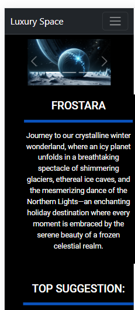
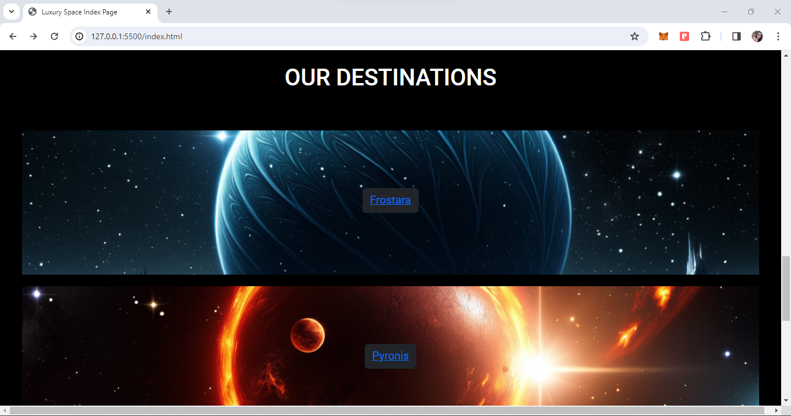
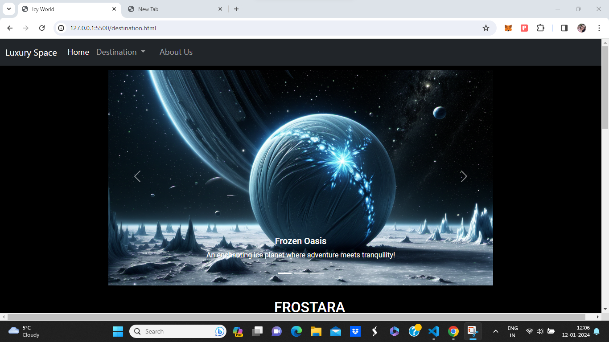
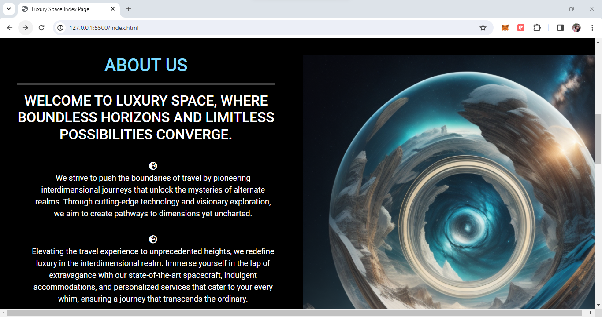
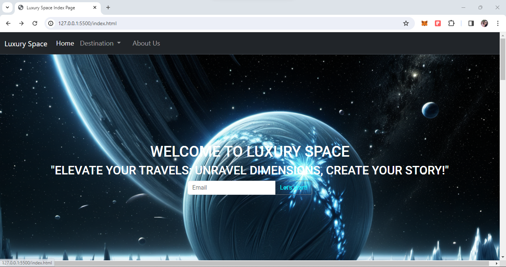
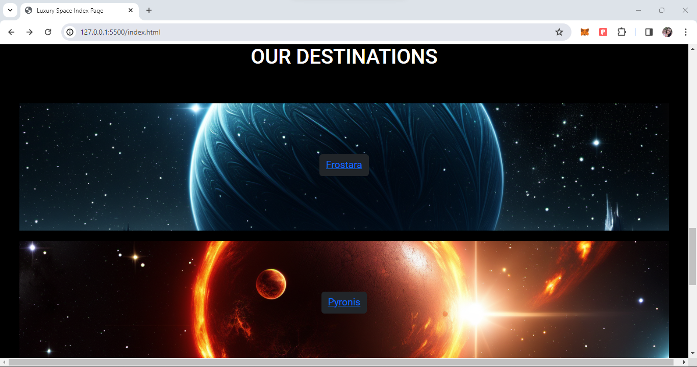
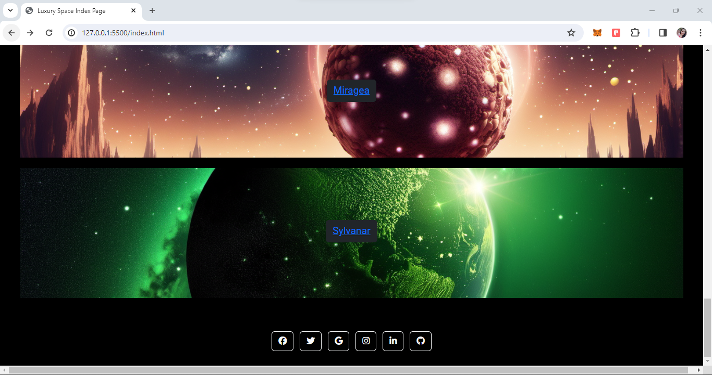

# Project Title: Luxury Space

## Description
"Welcome to Luxury Space — your go-to platform for seamless travel planning and exploration. Our website is designed to provide users with a one-stop solution for discovering, planning, and organizing your next adventure across dimensions with us. Explore a curated collection of destinations, find detailed information about attractions, and easily see user reviews of our available attractions and destinations. Whether you're a seasoned traveler or embarking on your first journey, Luxury Space is here to make your travel dreams a reality. Start your exploration today and let the journey begin!"

## Team Members

- [Joe] - Team Lead
- [Priyanka] - Developer
- [Cian] - Developer
- [Ossama] - Developer

## Technologies Used
- Github
- Gitpod
- Visual Studio Code
- Bootstrap
- Chat GPT: https://chat.openai.com
- Midjourney AI https://www.midjourney.com 

## Website Structure
### Pages
- Index
- Destinations: Destination 1, Destination 2, Destination 3, Destination 4

### Architecture 
- Consitent navbar and footer
- index.html landing page which includes a hero image, call to action and an about me page, and links to the 4 destination pages
- 4 destination pages each include a desccriptive carousel, followed by a description of the destination, small image gallery of popular attractions, as well as user reviews.

## Ideation

### Collaborative Ideation Doc
https://docs.google.com/document/d/1I16nMBnwyo8vOtNZJg-03Dy7k6aS3mEOLERZoZLBS8M/edit?usp=sharing

### User Stories
User Stories
- As a user I want to be able to know what destinations that are available to me.
- As a user I want to know what packages are available so that I can know what’s involved.
- As a user I want to see feedback and reviews.
- As a user I want to see the value in traveling with Luxury Space.
- As a user  I want detailed information about each interdimensional destination, including any potential risks or challenges, to ensure a secure and enjoyable trip.
- As a customer, I want to know what I can see and experience on my trip.

### HomePage Taglines & Calls to Action

- "Elevate Your Travels: Unravel Dimensions, Create Your Story!"
- "Yearning for Adventure? Embrace Infinite Realities Today!"
- "Adventure Awaits: Dive into Dimensions Beyond Your Wildest Dreams!"

### Future Improvements
- CSS styling would be improved: Responsiveness, Colour Scheming, Layout, Reactive responses
- Further and more clear call to actions
- More Destinations and each planet has 4 destinations. 
-- An additional landing page for each of the 4 destinations further highliting activities and facilities for the destinations.
- More general interactivty could be implemented
- Agile workflow - Implementation and delegation of tasks better tracked.

## Screenshots of Final Project

## Acknowledgments

### References
Trip Advisor: https://www.tripadvisor.ie/
Mockplus Example Websites: https://www.mockplus.com/blog/post/travel-website-templates
w3Schools Bootstrap: https://www.w3schools.com/bootstrap/bootstrap_get_started.asp
Bootstrap Documentation: https://getbootstrap.com/docs/5.3/getting-started/introduction/

### Shoutouts
- Coffee & Tea without their contributions nothing would have been finished.
- Staff at Mckesson for hosting the event and their presentations.
- Thanks to Martin too.

